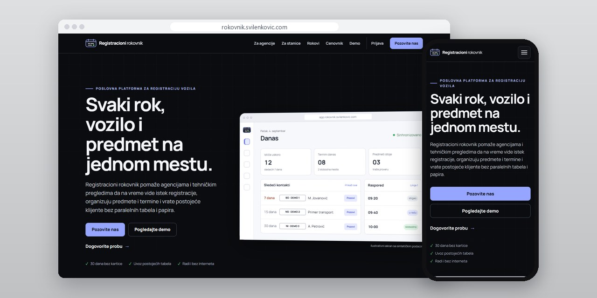
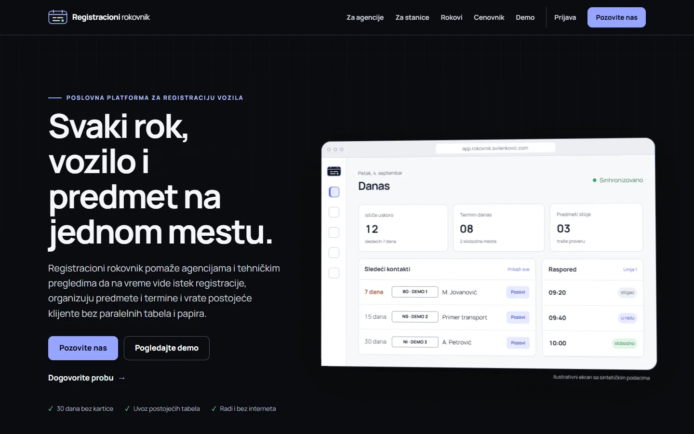
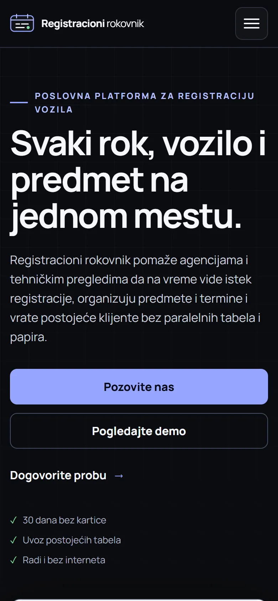

# Registracioni rokovnik

Web app for registration agencies and inspection stations: registration expiry, customers, appointments and cases, even without a connection.

**[rokovnik.svilenkovic.com](https://rokovnik.svilenkovic.com/)** · [Srpski](README.sr.md)

> [!NOTE]
> My own product. The source code is private. This page describes what it does and how it is built.

<table>
  <tr><td><b>Client</b></td><td>Own product</td></tr>
  <tr><td><b>Industry</b></td><td>Software for vehicle registration agencies and inspection stations</td></tr>
  <tr><td><b>Location</b></td><td>Serbia</td></tr>
  <tr><td><b>Type</b></td><td>Multi-tenant web app (PWA)</td></tr>
  <tr><td><b>My role</b></td><td>Design, development, SEO, hosting and maintenance</td></tr>
  <tr><td><b>Stack</b></td><td>React 19, Vite, PWA, Astro</td></tr>
</table>

## About the project

Registracioni rokovnik is my own product for vehicle registration agencies and technical inspection stations in Serbia. It keeps customers, vehicles, expiry dates, consents, appointments and cases in one history, so staff can see whose registration runs out soon, which case is stuck and where there is a free slot.

The app never contacts anyone by itself. It builds the work list from the expiry date, earlier attempts, the channel the customer agreed to and free capacity, and notes why each person is on it. The call or message is left to the employee, who then records what actually happened. Default reminders fall 30, 15 and 7 days before expiry and 3 days after, and imported contacts without proof of consent never reach the contact lists.

## What I built

- A React 19 and Vite PWA with offline drafts: the working set stays available for up to 72 hours without an account check and syncs when the connection returns
- Updates that download in the background and switch over only when nothing is being written; a failed install keeps the previous version
- Data kept apart per company and location in both the database and the app, with personal accounts, an audit trail and device revocation
- CSV and XLSX import with a preview of mapping, errors and duplicates, run through a background job queue and reversible per batch
- Scheduling for inspection stations by line, vehicle category, duration and breaks, with walk-ins, a waiting list and an eight-week load view
- An Astro landing page and a public status page

## Results

| | Performance | Accessibility | Best practices | SEO |
| :-- | :-: | :-: | :-: | :-: |
| Mobile | 98 | 100 | 100 | 100 |
| Desktop | 100 | 100 | 100 | 100 |

Lighthouse, lab test of the live site, September 2026.

## Screenshots

<table>
  <tr>
    <td width="68%" valign="top"></td>
    <td width="32%" valign="top"></td>
  </tr>
</table>

---

Built by [D. Svilenković](https://svilenkovic.com).
